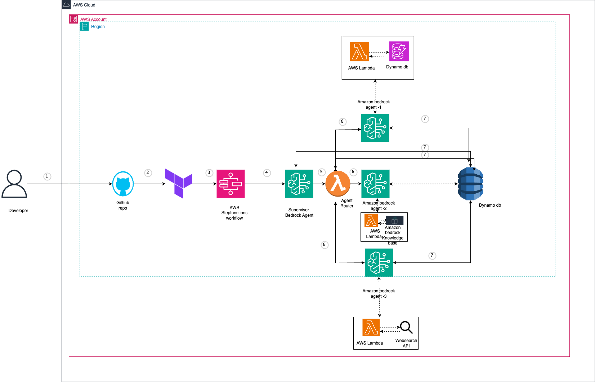

# Multi-Agent AI Blueprint with Supervisor-Child Architecture

This Terraform module creates a reusable blueprint for deploying a multi-agent AI system on AWS using Amazon Bedrock and a supervisor-child architecture. The system consists of a supervisor agent that handles initial interactions and delegates tasks to specialized child agents.

## Architecture Overview



The architecture follows these key principles:

1. **Supervisor-First Approach**: All user requests are first processed by a supervisor agent that analyzes the request and determines which specialized child agent should handle it.

2. **Specialized Child Agents**: Each child agent is specialized in a particular domain (e.g., data analysis, code generation, infrastructure planning).

3. **Stateful Conversations**: Conversation state is maintained in DynamoDB to provide context across interactions.

4. **Orchestrated Workflow**: AWS Step Functions orchestrates the flow between agents, ensuring proper handoffs and response formatting.

## Features

- Configurable number of child agents
- Customizable agent instructions and specialties
- Flexible model selection for each agent
- Optional knowledge base integration
- State management for conversation context
- IAM roles and policies for secure operation

## Usage

```hcl
module "multi_agent_ai" {
  source = "github.com/your-org/multi-agent-ai-blueprint"
  
  name_prefix = "my-ai-system"
  environment = "dev"
  
  # Supervisor configuration
  supervisor_model_id = "anthropic.claude-3-sonnet-20240229-v1:0"
  supervisor_instructions = "Custom instructions for the supervisor agent..."
  
  # Child agent configuration
  child_agent_count = 3
  child_agent_model_ids = {
    0 = "anthropic.claude-3-sonnet-20240229-v1:0"
    1 = "anthropic.claude-3-haiku-20240307-v1:0"
    2 = "anthropic.claude-3-sonnet-20240229-v1:0"
  }
  child_agent_specialties = {
    0 = "Data Analysis"
    1 = "Code Generation"
    2 = "Infrastructure Planning"
  }
  
  # Optional knowledge base
  create_knowledge_base = true
  
  tags = {
    Project = "AI Assistant"
    Owner   = "AI Team"
  }
}
```

## Inputs

| Name | Description | Type | Default | Required |
|------|-------------|------|---------|----------|
| aws_region | AWS region to deploy resources | string | `"us-east-1"` | no |
| name_prefix | Prefix for naming resources | string | `"multi-agent-ai"` | no |
| environment | Environment name (e.g., dev, staging, prod) | string | `"dev"` | no |
| tags | Additional tags to apply to resources | map(string) | `{}` | no |
| supervisor_model_id | Amazon Bedrock model ID for the supervisor agent | string | `"anthropic.claude-3-sonnet-20240229-v1:0"` | no |
| supervisor_instructions | Instructions for the supervisor agent | string | See variables.tf | no |
| child_agent_count | Number of child agents to create | number | `3` | no |
| child_agent_model_ids | Map of child agent index to Amazon Bedrock model ID | map(string) | See variables.tf | no |
| child_agent_specialties | Map of child agent index to specialty description | map(string) | See variables.tf | no |
| child_agent_instructions | Map of child agent index to instructions | map(string) | See variables.tf | no |
| create_knowledge_base | Whether to create a knowledge base for the agents | bool | `false` | no |
| create_iam_roles | Whether to create IAM roles or use existing ones | bool | `true` | no |
| existing_agent_role_arn | Existing IAM role ARN for Bedrock agents | string | `""` | no |

## Outputs

| Name | Description |
|------|-------------|
| supervisor_agent_id | ID of the supervisor agent |
| supervisor_agent_arn | ARN of the supervisor agent |
| child_agent_ids | Map of child agent indices to their IDs |
| child_agent_arns | Map of child agent indices to their ARNs |
| orchestrator_state_machine_arn | ARN of the Step Functions state machine orchestrating the agents |
| agent_state_table_name | Name of the DynamoDB table storing agent state |
| knowledge_base_id | ID of the knowledge base (if created) |
| invoke_instructions | Instructions for invoking the multi-agent system |

## How It Works

1. **Initial Request Processing**:
   - User request is sent to the Step Functions workflow
   - The supervisor agent analyzes the request

2. **Agent Selection**:
   - The agent router Lambda determines which child agent should handle the request
   - The conversation state is saved to DynamoDB

3. **Task Delegation**:
   - The selected child agent processes the request with its specialized knowledge
   - The child agent generates a response

4. **Response Formatting**:
   - The supervisor agent formats the child agent's response
   - The final response is returned to the user

## Customization

### Adding New Child Agent Types

To add a new child agent type:

1. Increase the `child_agent_count` variable
2. Add a new entry to `child_agent_model_ids`, `child_agent_specialties`, and `child_agent_instructions`
3. Update the agent router Lambda function to recognize the new agent type

### Using Different Models

You can specify different Amazon Bedrock models for each agent by modifying the `supervisor_model_id` and `child_agent_model_ids` variables.

## Requirements

- Terraform >= 1.0.0
- AWS Provider >= 4.0.0
- AWS CLI configured with appropriate permissions
- Amazon Bedrock access enabled in your AWS account

## License

MIT
